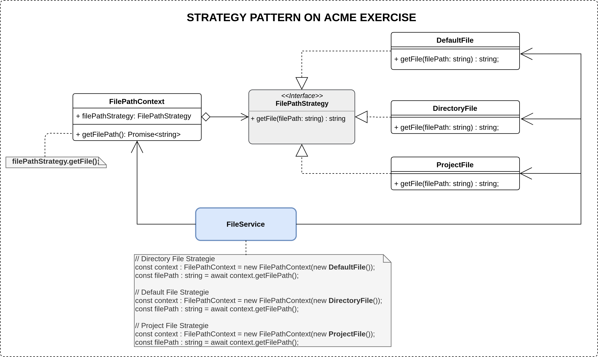

<h1 align="center"> ACME COMPANY </h1>


[](https://github.com/jcalarcon98/employees-salaries/blob/main/LICENSE)


## Table of Contents

* [About the exercise](#about-the-exercise)
  * [Problem](#problem)
  * [Solution](#solution)
* [Solution Archutecture](#architecture)
  * [Low level Design](#low-level-design)
  * [Core Communication](#core-communication)
  * [High Level Design](#high-level-design)
* [Approach and Methodology](#approach-and-methodology)
  * [Solution analysis](#solution-analysis)
  * [Elements involved in the solution](#elements-involved-in-the-solution)
  * [Project Structure](#project-structure)
  * [Business Logic](#business-logic)
* [Usage](#usage)
  * [Execute application](#execute-application)
  * [Run tests](#run-tests)
  * [Get code coverage](#run-code-coverage)
  * [Run linter](#run-linter)
* [Extras](#extras)
  * [Strategy Pattern Applied](#strategy-pattern-applied)
  * [AAA pattern on tests](#aaa-pattern-on-tests)

## About the Exercise

The main purpose of this project is to evaluate my software development skills.

### Problem
<hr/>

The company ACME offers their employees the flexibility to work the hours they want. They will pay for the hours worked based on the day of the week and time of day. The goal of this exercise is to calculate the total that the company has to pay an employee, based on the hours they worked and the times during which they worked.

### Solution
<hr/>

To solve the problem within the ACME company, it was decided to create a software that allows to enter a .txt file, with the information of the employees in the specified format, which will return the name of the employee and the amount to be paid, as in the following example:
<p align="center">
  
</p>

To achieve this solution it was decided to use the next technologies:

- [NodeJs](https://nodejs.org/en/) with [TypeScript](https://www.typescriptlang.org/) for development.
- [Jest](https://jestjs.io/) for testing and Code coverage.
- [Airbnb style Guide](https://airbnb.io/javascript/) for code style.
- Also the most relevant practices from [NodeJs best Practices](https://github.com/goldbergyoni/nodebestpractices) were used, practices like:
  - [Project Structure Practice](https://github.com/goldbergyoni/nodebestpractices#1-project-structure-practices) 
  - [Code Style Practices](https://github.com/goldbergyoni/nodebestpractices#3-code-style-practices)
  - [Testing and Quality Practices](https://github.com/goldbergyoni/nodebestpractices#4-testing-and-overall-quality-practices)


<hr/>

## Architecture

### Low Level Design

This diagram provides an overview of the communication between the application components. 

<p align="center">
  
</p>

### Core Communication

This diagram shows the main communication between the elements of each component.

<p align="center">
  
</p>

### High Level Design

This diagram shows the communication between all the elements of the application, detailing the content of each of the components.

<p align="center">
  
</p>

<hr/>

## Approach and Methodology

In order to achieve the solution, the following activities were carried out

<hr/>

### Solution analysis

Before developing the solution, the problem was carefully analyzed, where possible scenarios to solve it were identified, and some restrictions that may alter the expected result were also found.

<hr/>

### Elements involved in the solution

The main elements involved in the solution were identified

- Employee
- File
- User Interface

<hr/>

### Project Structure

After identifying the main elements involved, we proceeded to map these elements as components of our application, you can see more detailed view [Here](#low-level-design).

<hr/>

### Business logic

Logic was developed for each of the elements identified.

## Usage

First of all, execute the following commands

```bash
git clone https://github.com/jcalarcon98/employees-salaries.git
cd employees-salaries
npm install
```

### Execute Application

```bash
npm run start
```

### Run Tests
```bash
npm run test
```

### Run Code Coverage
```bash
npm run coverage
```

### Run Linter
```bash
npm run lint
```

## Extras
Some extra relevant features in this project.
### Strategy Pattern Applied

The Strategy Pattern was implemented in order to identify how the system user will provide the file with employee information. 

<p align="center">
  
</p>

This approach allows adding new ways of providing the file, without affecting the implementation of the other strategies already implemented, and also facilitates the maintainability of the code. 

### AAA pattern on tests

All tests inside this Project are structured by the AAA pattern

**Arrange**: All the setup code to bring the system to the scenario the test aims to simulate. This might include instantiating the unit under test constructor, adding DB records, mocking/stubbing on objects and any other preparation code

**Act**: Execute the unit under test. Usually 1 line of code

**Assert**: Ensure that the received value satisfies the expectation. Usually 1 line of code


Example:

```ts
test('Should return a list of employees if all conditions are valid', async () => {
    // Arrange
    const defaultFileOption = '3';
    jest.spyOn(UserInterface, 'makeQuestion').mockImplementation(async () => defaultFileOption);

    // Act
    const employees = await userInterfaceController.execute();

    //Assert
    expect(employees).toHaveLength(6);
  });
```